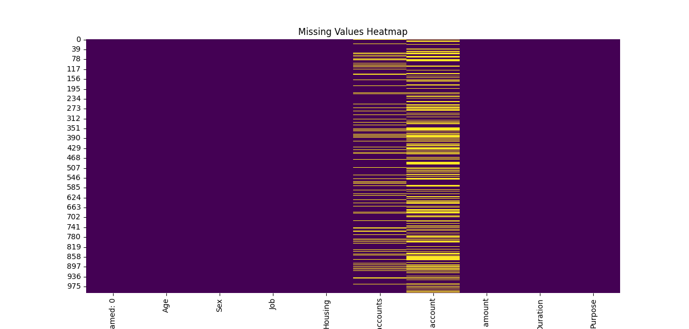
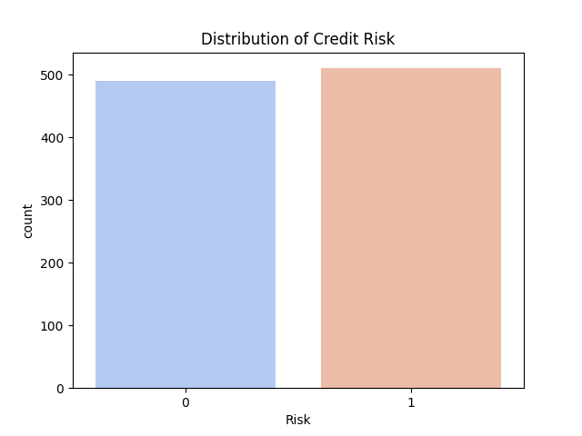
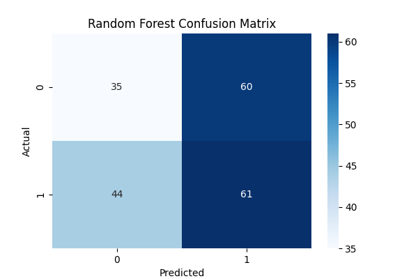
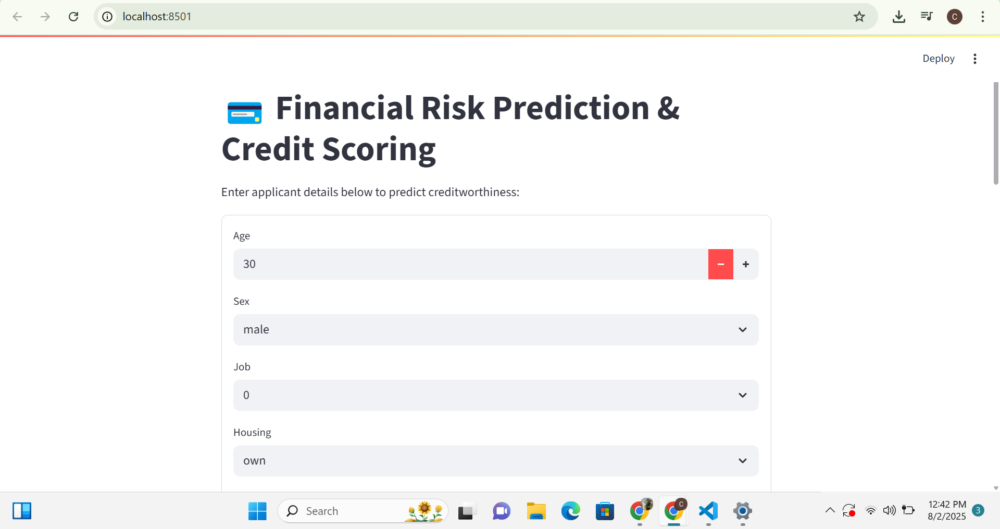

# 💳 Financial Risk Prediction & Credit Scoring

## 📌 Overview
This project predicts the **creditworthiness** of loan applicants using **Machine Learning**.  
It combines **data analytics, predictive modeling, and interactive visualization** to support **risk assessment and decision-making** in financial services.

Key features:
- **Data Cleaning & Preprocessing** for structured and categorical data.
- **Model Training** using Logistic Regression & Random Forest.
- **Evaluation Metrics** with confusion matrices, classification reports, and accuracy scores.
- **Interactive Streamlit Dashboard** for real-time credit scoring predictions.

---

## 🎯 Why This Project Matters
Financial institutions need to make **data-driven lending decisions** while minimizing default risk.  
This project demonstrates:
- Ability to **analyze complex datasets** (transferable from biomedical to finance).
- Application of **machine learning for predictive analytics**.
- Use of **interactive dashboards** for actionable business insights.

Perfectly aligns with roles like:
- **Corporate Analyst Development Program**
- **Global Risk & Compliance**
- **CIB Research & Analytics**

---

## 📂 Project Structure
```
financial-risk-prediction/
│
├── data/                        # raw & cleaned datasets
├── scripts/                     # data cleaning & training scripts
├── dashboard/                   # Streamlit prediction app
├── models/                      # trained ML models
├── requirements.txt             # dependencies
├── .gitignore                   # ignored files
└── README.md                    # project documentation
```

---

## 📊 Key Steps

### 1️⃣ Data Exploration & Cleaning
- Removed unnecessary columns (e.g., ID).
- Encoded categorical variables using one-hot encoding.
- Handled missing values and standardized numeric features.

### 2️⃣ Model Training & Evaluation
- **Logistic Regression** — interpretable baseline classification model.
- **Random Forest** — ensemble learning for higher accuracy & feature importance.
- Evaluated using **accuracy, confusion matrices, and classification reports**.

### 3️⃣ Interactive Dashboard
- Built with **Streamlit** for real-time credit scoring.
- User inputs loan application details and receives instant predictions.
- Displays probability scores for decision transparency.

---

## 🚀 Installation & Setup

### Clone the repository
```bash
git clone https://github.com/yourusername/financial-risk-prediction.git
cd financial-risk-prediction
```

### Create & activate virtual environment
```bash
python -m venv venv
venv\Scripts\activate  # Windows
source venv/bin/activate  # Mac/Linux
```

### Install dependencies
```bash
pip install -r requirements.txt
```

---

## 🛠️ Usage

### **Step 1: Data Cleaning**
```bash
python scripts/data_exploration_cleaning.py
```

### **Step 2: Train Models**
```bash
python scripts/train_model.py
```

### **Step 3: Run Dashboard**
```bash
cd dashboard
streamlit run app.py
```
The app will open at:  
`http://localhost:8501`

---
## 📊 Results

This section presents the key outputs from the project, including visualizations, model evaluation metrics, and the interactive dashboard.

### 🔍 Data Insights
- **feature Correlation Heatmap**


- **Missing Values Heatmap**


---

### 📈 Model Performance
- **Credit Risk**


- **Random Forest Confusion Matrix**


---

### 🖥️ Interactive Dashboard
- **Dashboard Home**

(images/output2.png)


## 📌 Future Improvements
- Batch prediction for multiple applicants via CSV upload.
- Feature importance visualization in dashboard.
- Deployment on **Streamlit Cloud** for public access.
